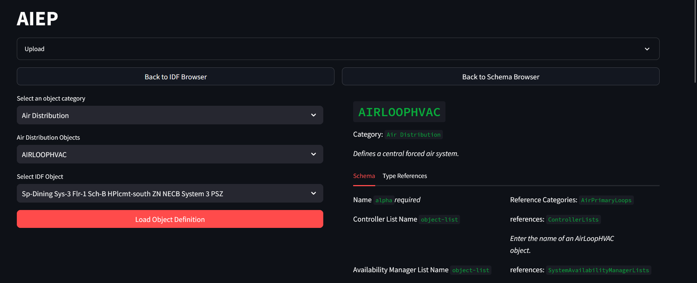

# aiep: Interfacing EnergyPlus with LLMs

This repo will be used (sporadically) for developing tooling to interface between LLM Agents and [EnergyPlus](http://energyplus.net).

OpenAI's GPT-4 model has extensive knowledge of EnergyPlus, as it appears that significant portions of the IO Reference and Engineering Reference were included in the training corpus at least to some extent; perhaps some discussion forums (e.g. unmethours) also were ingested. However, the models still struggle to some extent to reason about provided IDF files directly. They can fairly effectively scaffold portions of IDFs, but of course it is challenging to build a complete IDF. Part of the motivation of this project is to be able to build LLM Agents which can better analyze, modify, and construct IDF files, as well as explore ways of representing, storing, and retrieving data from large datasets of IDFs in a manner suitable for EnergyPlus. One of the key hypotheses is that when reasoning about IDF files, they would be best representing as a directed graph structure of connected objects. Additionally, there is good reason to think that embedding the EnergyPlus reference documents as docstore over which retrieval and Question-Answering can be executed would be of great utility, both to an end user and an LLM agent analyzing and modifying IDFs.

Key tooling underlying the work will include [Archetypal](https://github.com/samuelduchesne/archetypal), [eppy](https://github.com/santoshphilip/eppy), and eventually [LangChain](https://github.com/langchain-ai/langchain), [NetworkX](https://github.com/networkx/networkx) and [Neo4J](https://github.com/neo4j/neo4j).

As an initial step, two tools have been implemented (but only tested with EnergyPlus 9.2.0 IDFs so far!).

### IDF to Pydantic / NetworkX

The first tool enables you to generate Pydantic representations of an IDF file as a graph, i.e. a list of `Nodes` and connecting `Edges`. Additionally, it returns the same graph as a built `nx.MultiDiGraph`.

### IDD to Pydantic

The second tool converts an `IDD` file to a rich pydantic schema, which can be used to reason about objects and object fields, or dynamically build models representing each IDF object type.

### Future

- Dynamically constructing `IDDField`'s structure according to meta-analysis of the IDD (in progress)
- Dynamically constructing subclassed `Nodes` with information from the IDD Pydantic schema (in progress)
- Using Graph Databases to store IDF files
- Collecting/Scraping IDFs
- Embedding EPlus Docs in a vector DB for retrieval and QA
- Searching/querying through GraphDBs to provide data to Agents
- Analyzing IDFs using Agents
- Operating on IDFs using Agents
- and more!
